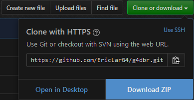

# g4dbr
_G4 biophysics database visualization and management_

  + [Installation](#Installation)
  + [Use](#Use)
  + [License](#License)

## Installation

To install, download the zip archive.



In R (e.g. the console of RStudio), run:

```{r install}
install.packages("devtools")
devtools::install_local("XXX/g4dbr-master.zip")
```

Where `XXX` is the filepath of the zip archive. Use slashes `/` rather than backslashes `\` even on Windows.

You may update some or all of the packages that were already installed or skip this step.


## Use

To use g4dbr, run:

```{r use}
library(g4dbr)
g4db()
```

The zip file contains the database (db.xlsx) and a demo input file (demo_input.xlsx) in the data subfolder. To use these files extract them from the archives then load into the g4db interface, in the _database_ and _ImportR_ tabs respectively.

## License

GPL-3 [Eric Largy](figures/https://github.com/EricLarG4)
