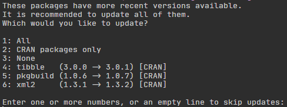

# g4dbr
_G4 biophysics database visualization and management_

  + [Installation](#Installation)
  + [Use](#Use)
  + [License](#License)

## Installation

In R (e.g. the console of RStudio), run:

```{r install_online}
install.packages("devtools")
devtools::install_github('EricLarG4/g4dbr', build_vignettes = T)
```

You may update some or all of the packages that were already installed, or skip this step.



Restart your R session before use.

## Use

### g4db

To use g4db, run:

```{r use}
library(g4dbr)
g4db()
```

For more details, consult the package and function documentation here using `help(package = 'g4dbr')`

#### pdf reports

To be able to generate reports in pdf (Word and HTML reports are possible out of the box), *tinytex* (a lightweight LaTeX distribution) must be installed.

Install the package with `install.packages('tinytex')`, then finish the installation using `tinytex::install_tinytex()`.

Restart your IDE and verify that `tinytex:::is_tinytex()` is `TRUE`.

In case of issue, check the [help page](https://yihui.org/tinytex/r/#debugging).

#### Demo files

<ins>**Local file system.**</ins> An example database (`demo_database.Rda`), an empty database (`empty_database.Rda`), and a demo input file (`demo_input.xlsx`) are located in the extdata subfolder of your package installation path. 

To locate these files, use `system.file("extdata/", package = 'g4dbr')` in R. On Windows, the output should be something like `C:\Users\username\Documents\R\win-library\X.Y\g4dbr`. 
**These files will be overridden if the package is re-installed, and removed is the package in uninstalled. Do not save files at this location** 

<ins>**From source zip.**</ins> The zip file contains the example database (`demo_database.Rda`), empty database (`empty_database.Rda`), and demo input file (`demo_input.xlsx`) in the inst/extdata subfolder.

<ins>**Use**</ins>
To use the demo files, load them in the `g4db()` app.

### Standalone extinction coefficient calculation

To use `epsilon.calculator`, run:

```{r use}
library(g4dbr)
epsilon.calculator("SEQUENCE")
```
where `SEQUENCE` is the DNA sequence of choice.

### Mass spectrometry spectrum data reduction

This tool can be ran from inside the *g4db* app. To use as a standalone function `mass.diet`, prepare your data in a data frame containing the following columns:

+ `mz`, the m/z axis,
+ `int`, the intensity,
+ `oligo`, the oligonucleotide names,
+ `buffer.id`, the buffer name,
+ `tune`, the MS tune name,
+ `rep`, the replicate number

Then run:

```{r}
library(g4dbr)
mass.diet(fat.mass = data.to.reduce, 
          base.start, base.end, 
          range.start, range.end, 
          baseline.int)
```

Where `data.to.reduce` is the dataframe prepared at the previous step, the *m/z* range to keep is given by `range.start` and `range.end`, the baseline for noise calculation with `base.start` and `base.end`, and the threshold coefficient for noise removal is specified with `baseline.int`.


### Database data removal

This tool can be ran from inside the *g4db* app. To use as a standalone function `database.eraser`, run:

```{r}
library(g4dbr)
database.eraser(db.to.erase,
                remove.oligos,
                erase.CD, erase.NMR, erase.MS, erase.UV)
```

Where `db.to.erase` is an .Rda file prepared with `g4db`, `remove oligos` is a vector containing the `oligo` names for which data must be removed, and `erase.CD`, `erase.NMR`, `erase.MS` and `erase.UV` are logical values indicating whether to remove data from the corresponging techniques (respectively circular dichroism, ^1^H-NMR, mass spectrometry, and UV-melting).

## License

GPL-3 [Eric Largy](figures/https://github.com/EricLarG4)
