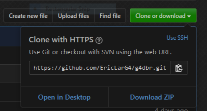

# g4dbr
G4 biophysics database visualization and management

To install, download the zip archive then in R run:



```{r install}
install.packages("devtools")

devtools::install_local("XXX/g4dbr-master.zip")
```

Where XXX is the filepath of the zip archive. Use slashes `/` rather than backslashes `\` even on Windows.

To use g4dbr, run:

```{r use}
library(g4dbr)

g4db()
```

