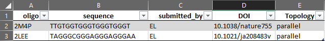
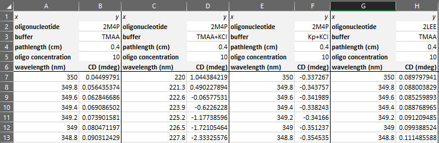
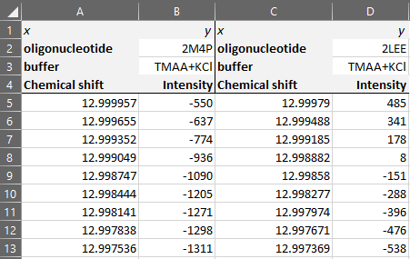
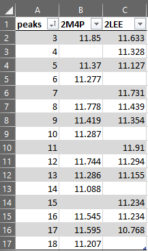
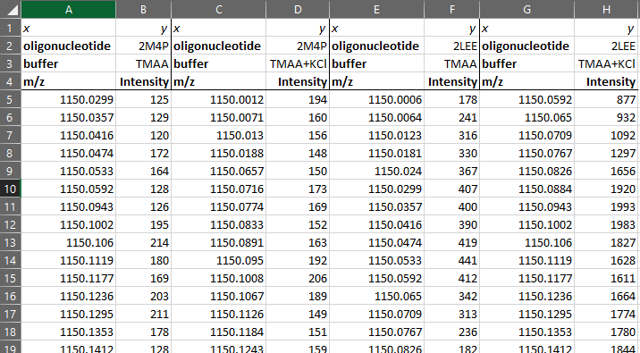
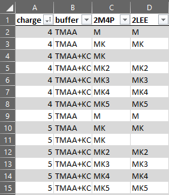

------

\newpage

```{r libraries, message=FALSE, warning=FALSE, include=FALSE, paged.print=FALSE}
library(tidyverse)
library(kableExtra)
library(ggthemes)
library(readxl)
library(writexl)
```

# Added features

```{r mirror, eval=FALSE, message=FALSE, warning=FALSE, include=FALSE, paged.print=FALSE}
# to mirror repository to team repo:
# D:\ownCloud\Projects\G4 database\g4dbr> git push --mirror https://github.com/g4db-team/g4dbr
```

## v. 0.48 

+ Creation of a package to encapsulate the app, additinal functions and datasets
  - Creation of datasets in .Rda format to replace the .xlsx files containing the mass and isotope references
  - These can still be modified but require to convert the modified excel file into .Rda within the package using `devtools::use_data()`
  - Five functions: _g4db_ to launch the app, _epsilon.calculator_ to calculate extinction coefficients of oligonucleotides (used within g4db but can be used as a standalone function), and _nb_row_extract_ and _nb_col_extract_ that determine the number of rows and columns in panelled figures to adjust their size within _g4db_, and _database.eraser_ to selectively delete data from a database.
  - Documentation of the functions
  - Documentation of the datasets
+ Database load button replaced by file import button
  - Database no more hard-linked to code, now the user can specify whichever database they want
+ Oligonucleotide selection now in two phases: bulk selection from _left sidebar_ and refinment from _general information table_
  - All oligonucleotides now selected by default in _left sidebar_ dropdown menu
  - _General information table_ displays oligonucleotides selected in _left sidebar_ (all by default)
  - Data displayed now filtered from the _general information table_ (selectable rows)
  - Any oligonucleotide information field (including potential new ones) can now be used for data selection via the table with no UI/server code change
+ _Buffer_ selection now also possible by _electrolyte_ and _cation_ selection
  - Further selection by existing individual _electrolyte_ + _cation_ combination still possible
  - Values gathered from selected oligonucleotides only
  - All values selected by default
  - Displayed data is intersection of _electrolyte_, _cation_, and _buffer_ selections (e.g. if KCl is not selected in _cation_ then TMAA + KCl data will not displayed even if it selected in _buffer_)
  _ When no _cation_ is specified in the input data (e.g. sample in TMAA alone), a `none` value is automatically attributed to allow selection of cation-less data in the dropdown menu. Another consequence is that there a now empty _cation_ row in the database
+ _MS_ can now be filtered by _tunes_ and _replicates_
  - _Tune_ names and _replicate_ numbers filter now available in the _right sidebar_ of the MS plot box, gathered only from selected oligonucleotides.
  - _Tune_ names and _replicate_ numbers are collected from the oligonucleotide- and electrolyte/cation/buffer-filtered MS data (i.e. only relevant _tunes_ and _replicates_ are proposed)
  _ Multiple selections possible
  _ Values default to the first available ones
  + _MS_ data size reduction
  _ Large MS file size can now be reduced before exporting to a database file using a data reduction pop up.
  _ Data reduction is performed by removing data outside of a provided _m/z_ range, and below an intensity threshold, both defined by the user.
  _ The intensity threshold is calculated as the mean of the intensity from a user-defined _m/z_ range (preferably where there is only noise), multiplied by a user-defined value (set at zero by default, i.e. no reduction occurs)
+ _MS_ figure grid layout can now be customized:
  - All variable couples among _oligonucleotide_, _buffer_, _replicate_ and _tune_ can be plotted
  - Switch added to transpose the grid
  - Dynamic legend added, which maps the two non-selected variables to the colour of the spectra. E.g. if the grid is _oligonucleotide_ x _buffer_, then colours will be attributed to _tune_ x _replicate_. No two superimposed spectra can have the same colour and variations across all four variables are visible at once. 
  - Label colours mirroring those of the spectra
+ Dynamic _MS_, _CD_ and _NMR_ figure dimension: grid height expands with number of rows automatically
+ _meltR_ now manages data that cannot be baseline-subtracted
  - Export data button with a switch between raw and fitted data added in _left sidebar_
  - Absorbance normalised to [0,1] for plotting when the baseline-subtraction is not performed.
+ _NMR_ peak labelling
  _ Character strings are accepted (possibility to assign several protons to the same peak/poorly resolved peaks)
  _ The labels are now vertically aligned to the peak, properly repelled from other labels and data points, and linked to the peaks with a segment
+ Database edition
  _ Database are now exported and read as .Rda files, instead of Excel files.
  _ Database files can now also be uploaded from the importR sidebar, to ease their edition (addition of new data). Only the last uploaded database (regardless of the tab that was used) is opened at any given time.
  _ Database edition is now easier (simpler UI) and faster (.Rda vs. Excel writing)
  _ Database filename automatically include the date.
  _ Databases can now be selectively (by oligonucleotide names selection) or entirely emptied. If emptied, the structure is conserved and can be re-populated.
  _ Password protection was removed because exporting a database file does not overwrite the opened file.
+ Switched the generation of datatables client-side (as opposed to server-side) to allow for the exporting of full datasets, rather than only what is displayed.
+ Fixed issue with the magrittr library sometimes not loading
+ Many UI improvements and corrections
+ Added an automated report generation
  _ pdf, HTML and Word formats can be selected
  _ all data, figure captions, figure sizing, file name, etc. are entirely automated

## v. 0.37

+ All data input tabs 
  - The _buffer_ field is now divided into two _buffer_ and _cation_ fields. Note that the field names are not used in the code, so it can be renamed as you wish at no extra cost (this is true of all variables ; only the relative position of the fields are used). 
+ UV-melting 
  - Table switched to a wide format, with header rows for buffer, etc. for easier/faster data copy-pasting
  - No more field for specifying the _ramp_ (cooling or heating), the automated assignment is used exclusively
+ MS input
  - Added _replicate_ and _tune_ field for MS input
  - Added check for duplication of _replicate_ and _tune_ fields upon database edition
+ MS label input
  - Table switched to a wider format (the long format became impractical after adding the new MS input field)
  - x = charge, y = labels
  - Exact same header as in MS input for quick copy-pasting, and easier to verify that all data to be imported has been labelled
+ NMR label input
  - Table switched to a wider format, consistent with the changes of MS labels (different data formatting in different tabs is prone to confuse users)
  - x = peak number, y = chemical shift ; empty rows are still not a problem, making it easier to paste data for several oligos at once in certain cases
  - Same heaser as in NMR input, same remarks than for MS labels


# Main features

## General overview

DatAniRban is dedicated to the consolidated vizualisation of circular dichroism (CD), ^1^H NMR, UV-melting and native ESI-MS data from selected G-quadruplex oligonucleotides whose structure has been deposited on the PDB. To do so, it also contains tools to selectively import and automatically treat raw data. DatAniRban can therefore be used as a data treatment/vizualization software, regardless of the database.

The main features are:

+ Vizualisation of CD, UV-melting, ^1^H NMR and ESI-MS data imported from a templated Excel file, or from the local database
+ Collapsible and tabulated interface
+ Automated data treatment
  + Conversion of CD to molar ellipticities
  + MS data normalization
  + ^1^H NMR and MS peak labelling
  + Quick and user-friendly data filtering (oligonucleotide, buffer, x-axis range)
+ Custom figures
  + Control over colors, size, and transparency of figures
  + Color palettes adapted to qualitative, sequential, and diverging data
  + Switch between overlaid and paneled figures for quick comparisons
  + Control over variables mapped in paneled figures
  + Automated colour mapping to non-paneled variables
  + Automated figure dimension change to accomodate multiple rows
+ Robust database
  + Selective data importing (by technique/oligo/buffer/data range) 
  + Duplicate detection/suppression
  + Password-protected edition
  + Traceability: automated deposition date and DOI link generation
  + Automated oligonucleotide and buffer list collection
  + Manages replication for MS and UV-melting data
  + Manages tuning for MS data
+ Open
  + Easy-to-export data tables (practical for standalone data treatment)
  + Import template easy to read in other software
  
## Use for data deposition

The raw data formatted in the template for DatAniRban can be deposited and viewed in several ways, which are open to other scientists without the need for proprietary software use. This approach is three-fold.

### Template file in an Excel-like software

Once pasted into the input template, the data can be deposited as is. It can then be explored natively in Excel or any open-source equivalent. The data formatted is formatted in a non-ambiguous format, and should be properly labelled in the header cells. The template is also very amenable to pieces of software allowing header cell import/management, such as Origin, in which import script can be used.

### Template file in DatAniRban

If deposited alongside DatAniRban, the raw data can also be visualized with this open-source software. The advantages over Excel/Origin for this particular application are numerous in terms of both ease and speed of use (data filtering, automated figures, etc.), and functionalities (peak labelling, normalisation/calculation, selective data export, etc.). See the _general overview_ for more details.

### Database file in DatAniRban

The use of DatAniRban also allows exporting selected datasets to a database were the data is consolidated and all calculation has already been performed. The database file can be deposited alongside DatAniRban, to enjoy all of its functionalities with faster performances, and control over submission authorship and dates.
  
-----

\newpage

# Preliminary remarks on data formatting

There are two basic way to store data, that is in a wide or long format. In the _wide format_, different datasets are presented in different columns. In the table below, the data is shown with a single x column and one y column for each oligonucleotide that was analyzed. 
```{r wide_format, echo=FALSE}

wide <- data.frame(
  x = c(1:10),
  Oligo1 = c(runif(n = 10)),
  Oligo2 = c(runif(n = 10)),
  Oligo3 = c(runif(n = 10))
)

wide %>%
  mutate(Oligo1 = cell_spec(Oligo1, 'latex', color = 'blue'),
         Oligo2 = cell_spec(Oligo2, 'latex', color = 'red'),
         Oligo3 = cell_spec(Oligo3, 'latex', color = 'green')) %>%
  kable("latex", 
        booktabs = T,
        escape = F, 
        linesep = '') %>% 
  kable_styling(latex_options = "striped") %>% 
  add_header_above(c('', 'Wide format' = 3), bold = T, italic = T)

```
It is easy to add data to such table, by simply pasting the new data set in a new column. It has two major drawbacks though:

1. If the x values are not shared, one need to add a new x column and the data will be mismatched (as in MS), leading to
1. It is globally harder to filter data by any given variables.


```{r wide_format_mis, echo=FALSE}

wide.mismatched <- data.frame(
  x1 = c(1:10),
  Oligo1 = c(runif(n = 10)),
  x2 = c(2:11),
  Oligo2 = c(runif(n = 10)),
  x3 = c(0:9),
  Oligo3 = c(runif(n = 10))
)

wide.mismatched %>%
  mutate(Oligo1 = cell_spec(Oligo1, 'latex', color = 'blue'),
         Oligo2 = cell_spec(Oligo2, 'latex', color = 'red'),
         Oligo3 = cell_spec(Oligo3, 'latex', color = 'green')) %>%
  kable("latex", 
        booktabs = T,
        escape = F, 
        linesep = '') %>% 
  kable_styling(latex_options = "striped") %>% 
  add_header_above(c('', 'Wide format mismatched' = 3), bold = T, italic = T)

```

Conversely, in the _long format_, all data sets are stacked in the same columns but each variable is stored in its own column. In the example above, the data has three variables x, y, and the oligonucleotide name, leading to three columns.

```{r long_format, echo=FALSE}

long <- wide %>%
  pivot_longer(cols = c(2, 3, 4),
               names_to = 'oligo.name') %>%
  mutate(x = ifelse(oligo.name == 'Oligo2', x+1,
                    ifelse(oligo.name == 'Oligo3', x-1, x))) %>%
  arrange(oligo.name) %>%
  arrange(x)

long %>%
  group_by(x) %>%
  mutate(oligo.name = cell_spec(oligo.name, 'latex', 
                                color = ifelse(oligo.name == 'Oligo1', 'blue',
                                               ifelse(oligo.name == 'Oligo2', 'red', 'green')))
  ) %>%
  kable("latex", booktabs = T,
        escape = F, 
        linesep = '') %>% 
  kable_styling(latex_options = "striped", font_size = 7)%>% 
  add_header_above(c('', 'Long format' = 2), bold = T, italic = T)

```

In this format, the number of columns is independent from the number of experiments. If a fourth variable was used, say a buffer name, a fourth column would have been added. Mismatched x values have no more impact, and the data can be readily sorted by any variable (Here by ascending `oligo.name` then ascending `x`). It is now much easier to filter the data by any given variable while conserving the data properly formatted in the table. 

Below the data has been filtered by `oligo.name` (only _Oligo1_ and _Oligo3_ are selected) and `x` values between 2 and 5, and `value` > 0.5. It would have been easy to filter by oligonucleotide from a _wide format_ table by not selecting the column, however filtering x and y values from tables with mismatched x scales must be performed column by column.

```{r long_format_filtered), echo=FALSE}

long %>%
  filter(oligo.name %in% c('Oligo1', 'Oligo3')) %>%
  filter(x > 2) %>%
  filter(x < 5) %>%
  filter(value > 0.5) %>%
  mutate(oligo.name = cell_spec(oligo.name, 'latex', 
                                color = ifelse(oligo.name == 'Oligo1', 'blue',
                                               ifelse(oligo.name == 'Oligo2', 'red', 'green')))
  ) %>%
  kable("latex", booktabs = T,
        escape = F, 
        linesep = '') %>% 
  kable_styling(latex_options = "striped")%>% 
  add_header_above(c('', 'Filtered long format' = 2), bold = T, italic = T)

```

The same goes for mapping variables to figures, in terms of what to plot on the x/y axes, which parameters control the data color, shape, size, etc., and creating paneled figures, (more details below), following the [grammar of graphics](https://link.springer.com/book/10.1007/0-387-28695-0) that has been implemented in the ggplot2 package of R.

It is however very impractical to work with a _long format_ table in Excel or the like, where it is necessary to stack each new data set and fill the variables such as oligo names, buffers, etc. manually. This is tedious and prone to errors particularly that it generates a lot more rows than in the _wide format_ (each extra variable doubles the number of rows, assuming all the possible experiments across these variables have been performed).

To summarize, it is easier to prepare a wide table in Excel, and then work with a long table for data manipulation and visualization. Consequently, the _wide format_ was selected for compiling data for importing into the database and an easy-to-fill template was created to do so. After the data is imported it is pivoted into the _long format_ automatically.

-----

\newpage

# Features and use of DatAnirban

## General interface features

### Organization

The interface is divided in 3 tabs that can be selected at the top of the screen:

+ _database_, to visualize the content of the database,
+ _ImportR_, to visualize new data and export all or part of it to the _database_,
+ _meltR_, to visualize and treat UV-melting data, and export all or part of it to the _database_ (via _ImportR_),

### Sidebars

Each tab has a sidebar on the left-hand side, which contains a number of tools for data importing, exporting, filtering, and formatting. This _left sidebar_ is collapsible to release some space for figures and tables on smaller screens. 

The sidebar from the _database_ and _ImportR_ tabs also contain a color palette selection menu, and submenu for certain palettes having variations. The available palettes include:

 + The well known Brewer palettes that include [qualitative, diverging, and sequential palettes ](https://a2.typepad.com/6a0105360ba1c6970c01b7c7187af2970b-pi),
 + Some [discrete palettes](https://observablehq.com/@d3/working-with-color) from [D3.js](https://d3js.org/), a JavaScript library for producing interactive data visualizations,
 + Several palettes inspired by the colors used by scientific journals/publishers (NPG, AAAS, NEJM, Lancet, JAMA, JCO, etc.)

Drop-down menus contains select all/deselect all buttons for quick data selection. The values from the _left sidebar_ modifies the data for *all* the content of the tab. Each tab has a specific and independent _left sidebar_. 

Given the amount of menus necessary for the _meltR_ tab, a large portion of it is hosted by two collapsible and movable "hovering" panels.

### Figures and tables

The figures and tables are hosted within collapsible and closable boxes, so that the user can select what data to display at any given time. 

Each figure box from the _database_ and _ImportR_ tabs features a _right sidebar_. They contain filtering and data formatting filters that are applied *only* on the corresponding figure. These sidebars are collapsible as well, and hidden by default.

All tables are sort-able and filterable to assist in exploring rich data sets, and find specific data points rapidly. Filtering the tables do *not* alter the figures. Each column can be selectively hidden, and some of the less interesting ones are hidden by  The data is presented in _long format_, which makes it easier to filter through, and to map variables into figures, because each variable is contained in its own column. 

All tables can be exported as .csv, .xlsx, or in the clipboard. Note however that this data is in a long format, that is not necessarily easy to work with with a piece of software like Excel, but is much more powerful to map different variables into figures.

## Database

### Input data

The _Database_ tab allows to consult the data contained into a database file, by selecting the oligonucleotide(s) of interest, and where necessary, specific buffers. This tab is read only (database modifications must be performed in the _Import R_ tab), but allows exporting all or part of the data.

The database data is contained in an Excel (.XL) file, in the _long format_. Although it is not formatted to be easily consulted nor modified in Excel, it is very much possible. 

The general info ( _info_) and data of each experimental method ( _CD_, _NMR_, _UV-melting_, _ESI-MS_) are stored in their own tab within the  Excel file, allowing to selectively read and write the database (see below). 

The database is loaded by clicking on the _load database_ button from the sidebar. By default, no data will be displayed to avoid long waiting times, particularly if the database is large. To start visualizing data, the _oligonucleotide(s)_ of interest must be selected from the drop-down menu just below. The list of _oligonucleotides_ is collected automatically from the info _panel_. It is therefore important to maintain this info accurately when important new experimental data.

By default, all available _buffers_ are selected ; they are automatically collected from the _CD_ and _UV-melting_ data. The buffers from MS and ^1^H NMR data are not collected ; their data is filtered immediately upon importing to save on memory use. It can be implemented if necessary, but it is unlikely that their buffers mismatch with those from _CD_ and _UV-melting_ (otherwise the database wouldn't be very consistent). It is always possible to trick the database by adding a fake data point with the desired buffer, if the problem were to arise punctually.

Once at least one oligonucleotide has been selected, the data will be displayed. 

### Visualization

#### General information.

This groups all the information data by the user. The DOI is automatically made into an hyperlink for quick access to the relevant publication presenting the high-resolution structure. The deposition date is added automatically when the data is imported through _ImportR_. 

From the sequence are computed the number of each and all nucleotides, the atomic composition, and the average and mono-isotopic masses. The two latter are calculated based on what was published in [Anal. Chem.](https://pubs.acs.org/doi/suppl/10.1021/acs.analchem.9b05298/suppl_file/ac9b05298_si_001.pdf), although it was streamlined as there is no need for isotopic distribution calculation, nor non-natural isotopic abundances.

#### Circular Dichroism.

The circular dichroism data is presented as a scatter and line plot colored by buffer and shaped by oligonucleotide (both changeable). The data can be shown in mdeg or molar ellipticities (default), and filtered by wavelength. Molar ellipticities are calculated automatically from the supplied mdeg data.

The spectra can be all overlaid (default), overlaid by oligonucleotide or buffer, or not overlaid at all, to ease the comparison of data sets. By default, only the data points are shown, but it is possible to add lines (by increasing their size), remove points (by decreasing their size), or display both.

The selected data is also shown in a table under the plot. Further filtering of the table does not alter the plot, nor does filtering from the the plot's _right sidebar_. 

#### NMR.

The ^1^H NMR spectra are presented as a line plot colored by oligonucleotide (changeable). The chemical shift is presented in descending order, as is tradition, and can be filtered. The same stacking options than for CD are available, but the default is unstacked for clarity. Peak labels are shown above the corresponding peaks, and linked by a segment. They are automatically repelled from other labels and data points. The spectra line size can be changed.

A data table is available, with the same remarks as previously.

#### UV-melting.

The UV-melting data is presented in two scatter plots. On the left-hand side, the fitted raw data is shown, where the right-hand side plot presents the baseline-subtracted data. The former shows how the latter was obtained, and in particular the fit that was used to determine the baselines and the thermodynamic parameters. The latter is more appropriate for visual determination of Tm, comparison across samples, and determination of the amount of folded species at any given temperatures.

The data is colored by `id`, which is unique for any given oligonucleotide-buffer-ramp-replicate combination. A paired color palette is particularly well-suited for this type of data visualization. Besides the colors, the temperature range, line size and transparency and point size can be changed.

A data table is available, with the same remarks as previously.

#### Native ESI-MS.

The MS data is not plotted when one or several oligonucleotides are selected until the button _plot MS_ has been clicked on. That is because the amount of data to plot can be quite large, leading to slow plotting speeds. To avoid long refresh times of the software every time a new oligo/buffer is selected/deselected, plotting (and re plotting) only occurs when desired. 

The spectra are shown unstacked, in an oligonucleotide/buffer grid. Labels for species defined when importing can be shown or not. The colors, m/z range and line size can be changed.

A table will be added.

## ImportR

The ImportR tab's purpose is to selectively import raw data into the database. As a corollary of this primary function, it gives allows automated data treatment and Visualization of CD, ^1^H NMR, UV-melting and MS data.

### Input data

The raw data must be supplied in a template .xlsx file, in a wide format (except for UV-melting so far) that is with one column per dimension with extra information being filled into a header.

To open said file in _ImportR_, click on _Browse..._ at the top of the _left sidebar_ and select the file.

The file is divided into seven tabs designed to contain raw data (UV, CD, NMR, MS), general oligonucleotide information (info), or peak labeling data (NMR and MS labels).

#### info.

Five fields must be filled, i.e.: 

+ `oligo` that is the name of the oligonucleotide, preferably a PDB code,
+ `sequence`, in the 5' to 3' direction, without spaces or dashes. If present, only the extinction coefficient will be affected, although this can be corrected.
+ `submitted_by` is the initials of whoever submits the data, for traceability purpose,
+ `DOI` is the DOI of the paper linked to the PDB deposition, it is converted into a link automatically in _ImportR_.
+ `Topology` contains a description of the structure that can be as long or short as necessary; it is displayed as is in the _database._

All the other fields that cab be seen in the corresponding table in _ImportR_ and _database_ are calculated by the software.



#### CD.

The CD data must be pasted in two columns, below the header, with the wavelenght in the first column and the ellipticity in mdeg in the second column. The oligonucleotide and buffer names, the cuvette path length, and the oligonucleotide concentration must be given in the header rows. It is important to keep buffer names consistent with the database content.

For every new data set (new oligonucleotide/buffer), the next two column must be used and so forth. Even if the wavelength axis is the same, it must be specified again; this allows dealing with mismatched axes.



#### NMR.

The ^1^H NMR template follows the same principle: two columns per oligonucleotide/buffer for the chemical shift and intensity, and two header rows for the oligonucleotide and buffer names. 

It is preferred to not import data that will not be visualized in the _database_. The user can either paste selectively the data into the template, or the full spectrum and use the filtering tools in _ImportR_. For online use, it is advised to paste selectively the data to avoid long uploading times.



#### NMR labels.

This tab is used to submit ^1^H NMR peak labelling information. The first column must be filled with peak numbers, in any order. For each oligonucleotide, a column must be added with the oligonucleotide name as title and the chemical shift of the corresponding peak below. All cells do not have to be filled, only those for which a given oligonucleotide has a peak with this number.



#### MS.

The MS template is identical to the NMR template, albeit that column one is _m/z_. 



It is strongly advided to only paste the necessary data to vizualise as it can get quite heavy otherwise, which is an issue for uploading and plotting times. A function was designed to quickly remove data points, by selecting a user-defined m/z range, and removing all data points whose intensity is lower than that of the average of a user-supplied baseline range. In the figure below, the MS spectra of 2M4P in TMAA was plotted from the full raw data (300-3150 _m/z_, focused on 1150-1650 _m/z_), that is 7.2 MB.

```{r msfilter, include=FALSE}

msfilter <- function(file = NULL, minmz = 1150, maxmz = 1650, basestart = 1250, baseend = 1450){
  
  df <- read_xlsx(file) %>%
    filter(mz > minmz) %>%
    filter(mz < maxmz) 
  
  df.baseline <- df %>%
    filter(mz < baseend) %>%
    filter(mz > basestart) %>%
    summarise(basemean = mean(int)) 
  
  df <- df %>%
    filter(int > df.baseline[[1]]) %>%
    write_xlsx(path = 'ressources\\filteredmz_markdown.xlsx')
}
```

```{r msfull, echo=FALSE}
read_xlsx('ressources\\raw_ms_markdown.xlsx') %>%
  filter(mz > 1150) %>%
  filter(mz < 1650) %>%
  ggplot(aes(x = mz, y = int)) +
  geom_line() +
  theme_pander() +
  xlab('m/z') +
  ylab('intensity')
```
After applying the filtering function, only 589 KB of data remains with no visible loss in terms of visualization.

```{r msfiltered, echo=FALSE}
unfiltered <- msfilter(file = 'ressources\\unfilteredmz.xlsx', 
         minmz = 1150, maxmz = 1650, 
         basestart = 1250, baseend = 1450)

read_xlsx('ressources\\filteredmz_markdown.xlsx') %>%
  ggplot(aes(x = mz, y = int)) +
  geom_line() +
  theme_pander() +
  xlab('m/z') +
  ylab('intensity')
```

#### MS labels.

This tab is aimed at providing the database with the species to label in the MS spectrum. It differs from the NMR label tab, where one must supply the chemical shift of each label. Here, the user must simply supply the name of the species that must be labelled, that is _M_ for the unaducted oligonucleotide, MK for a single potassium adduct, MK2 for a two-potassium adduct species, and so forth. 

In order to label the different charge states and buffers independently, the first two columns must contain their respective values. All following columns must be titled with the oligonucleotide name and the species name below. Not all cells must be filled, only those for which a species must be labelled for a given oligonucleotide/buffer/charge.



#### UV-melting.

The UV-melting tab is neither completely in a wide or long format. It will be made into a wide format and described here in the coming days.

The temperature can be supplied in Celcius or Kelvin, _meltR_ will convert it automatically to Kelvin where necessary.

### Data vizualisation and selection

The interface for vizualisation and all filters and options are roughly the same as in the _Database_ tab. The main difference is the absence of UV-melting plots, as they have the dedicated _meltR_ tab.

The behavior for data plotting upon importing data is also the same, with the MS plot being subject to an additional button click.

Importantly, the oligonucleotide and buffer selections, as well as the figure range filters, *do* condition what will and will not be exported to the database.

### Database edition

To add new data to the database, the data must be opened in _ImportR_, then selected and filtered (oligonucleotide/buffer/x-axis range) as desired. If only a partial import is desired (e.g. only CD data), it is not necessary to deal with the other techniques. Although all the data will be displayed (expect MS by default), only the selected ones will be exported (as explained below). If UV-melting data must be imported, then it must be first treated in _meltR_.

To write the selected data to the database, the database must first be loaded from within the _database_ tab, then the techniques to export must be switched on in the _left sidebar_. All techniques for which the toggle is off will *not* be written into the database, regardless of them being displayed in _ImportR_.

A password must be supplied to avoid accidental database edition, and finally a click on _Write to db_ will edit the database. For each technique, as well as the _info_, the software will look for and remove duplicated data (by technique, oligonucleotide, buffer, and x-axis value). It remains therefore possible to submit additional buffers or extended data ranges to already existing oligonucleotides in the database. For instance, one can submit a 800-2500 _m/z_ MS spectrum to an oligonucleotide for which a 1000-2000 _m/z_ already exists in the database; the software will append the 800-1000 and 2000-2500 _m/z_ data to it, without duplicating the points from the original database data.

## MeltR

Still to come...


