  
```{r, include = FALSE}
knitr::opts_chunk$set(
tidy=TRUE, tidy.opts=list(width.cutoff=50),
fig.align='center',
collapse = TRUE,
warning = FALSE,
message = FALSE,
comment = "#>"
)
```

```{r set-options, echo=FALSE, cache=FALSE}
options(width = 1000)
```

> *Copyright 2020 [Eric Largy](https://github.com/EricLarG4). Licensed under the GPL-3 license.*

\newpage

# General overview

## Intended and less-intended uses

*g4dbr* is an R package containing the Shiny app *g4db* that is dedicated to the <ins>creation</ins>, <ins>vizualisation</ins>, and <ins>reporting</ins> of curated circular dichroism (CD), ^1^H-NMR, UV-melting and native mass spectrometry (MS) data from oligonucleotides. Although specifically developed for G-quadruplex forming sequences deposited on the PDB, *g4dbr* can be used with any sequence.

Users can either employ the app to visualize a database generated by *g4db*, visualize data pasted into a templated Excel file (provided in the package), and create/edit/complete a *g4db* database from data supplied in said template.

The long-term goal is to provide tools for the robust **deposition** of raw experimental data, and processed data derived from them, while allowing for easy and versatile visualisation and reporting. 

Raw data pasted in the supplied Excel template can be deposited, and visualized in several ways, which are open to other scientists without the need for proprietary software. The approach is two-fold:

### Templated .xlsx file deposition as is

Once pasted into the input template, the data can be deposited as is. It can then be explored natively in Excel or any open-source equivalent. The data is formatted in a non-ambiguous layout, provided it is properly labelled in the header cells. 

The template is also very amenable to pieces of software allowing header cell import/management, such as Origin, in which import scripts can be used.

Of course, the template can be natively imported in the *g4db* app. The advantages over Excel/Origin for this particular application are numerous in terms of both ease and speed of use (data filtering, automated figures, etc.), and functionalities (peak labelling, normalisation/calculation, selective data export, etc.). See the [Main features](#main-features) section for more details.

Any data treatment and filtering perfomed within *g4db* is not saved into the .xlsx file. To save this into a new or existing database file, the second approach must be used:

### Rdata file

*g4db* allows exporting selected datasets into an RData (.Rda) file where the data is consolidated and all calculation has already been performed. This leads to faster figure display, smaller file size, and is amenable to host very large dataset (where Excel is limited in row numbers).

The downside of this approach is that it cannot be handled outside of R. Note, however, that *g4db* is not required to open and use the data, it can be natively loaded in R using the `load` function, for instance below for a demo database provided in the package:

```{r load.demo.db, eval=FALSE, include=TRUE}
load(system.file("extdata/demo_database.Rda", package = 'g4dbr'))
```

## Extended scope

*g4dbr* includes a number of functionalities that will be described here within the context of their intended use, but that can be utilized outside of this scope, *i.e.* 

+ automated or semi-automated data filtering, treatment and labelling, 
+ computation of molar extinction coefficient ($\lambda$ = 260 nm) of oligonucleotides (*epsilon.calculator*),
+ UV-melting data treatment (*meltR*),
+ MS data size reduction (*mass.diet*)
+ Database file selective data deletion (*database.eraser*)

## Main features

Below is a list of the main features of *g4dbr*.

+ Vizualisation of CD, UV-melting, ^1^H-NMR and native MS data gathered in a database (.Rda format)
  + Collapsible and tabulated interface
  + Quick and user-friendly data filtering in tables and figures (*e.g.* oligonucleotide, buffer, cation, x-axis range,...)
    + Automated buffer list collection
    + Automated tune and replicate collection
  + Control over the database content, display, and reporting (see below)
+ Robust database creation and edition
  + Data imported from a templated Excel files
  + Selective data importing (by *e.g.* technique/oligo/buffer/data range) 
  + Duplicate detection/suppression
  + Automated deposition date and DOI link generation for traceability purpose
  + Manages replication for MS and UV-melting data
  + Manages tuning for MS data
+ Automated data treatment
  + Conversion of CD to molar ellipticities
  + MS data normalization
  + ^1^H-NMR and MS peak labelling
  + UV-melting data normalization and conversion to folded fraction
+ Custom figures
  + Control over colors, size, and transparency of figures
  + Color palettes adapted to qualitative, sequential, and diverging data
  + Switch between overlaid and paneled figures for quick comparisons
  + Control over variables mapped in paneled figures
  + Automated colour mapping to non-paneled variables
  + Automated figure dimension change to accomodate multiple rows
+ Automated report generation
  + pdf, HTML and Word formats can be selected
  + All data, figure captions, figure sizing, file name, etc. are generated dynamically without user input
+ Open
  + Easy-to-export data tables (practical for standalone data treatment)
  + Import template easy to read in other software

# Installation and setup

## Installation

Install from Github using:

```{r install_online, eval=FALSE, include=TRUE}
install.packages("devtools")
devtools::install_github('EricLarG4/g4dbr', build_vignettes = T, build_manual = T)
```

Alternatively, download the .zip archive from [GitHub](https://github.com/EricLarG4/g4dbr) then run:

```{r install, eval=FALSE, include=TRUE}
install.packages("devtools")
devtools::install_local("XXX/g4dbr-master.zip")
```

Where `XXX` is the file path to the zip archive.

## Setup

Load the package with:

```{r setup}
library(g4dbr)
```

# *g4db*

## Running the app

Only one function must be called to use all functionalities from *g4dbr*:

```{r running, eval=FALSE, include=TRUE}
g4db()
```

This function opens a Shiny app in either the currently used IDE, or a web browser.

Other functions used in *g4db* are packaged in *g4dbr*, and can be used as standalone tools. Refer to the [Other functions and reference files](#other-functions-and-reference-files) section.

## Interface overview

The interface is divided in 3 tabs that can be selected at the top of the screen, and are used to accomplished specific tasks:

+ _database_, to visualize, report, and remove data from a database file.
+ _importR_, to visualize and process raw data, and export all or part of it to a database file,
+ _meltR_, to visualize and treat UV-melting data, and export all or part of it to the a database (via _importR_).

The tabs make use of various sidebars, mainly to perform data importing, filtering, processing, exporting and reporting.

### Figures and tables

In the main area of the interface are the figures and tables, within collapsible and closable boxes, letting the user select what data to display.

All tables are sortable and filterable to assist in exploring rich data sets, and find specific data points rapidly. The data is presented in _long format_, which makes it easier to filter through, and to map variables into figures, because each variable is contained in its own column. Columns can be selectively hidden, and some of the less relevent ones are hidden by default.

Data presented in figures and tables reflects the values given to the different filters. On the contrary, filtering the tables does *not* alter the figures, it is only a mean of accessing and/or exporting a subset of the data. 

All tables can be exported as .csv, .xlsx, or in the clipboard. All columns will be exported, regardless of their visibility in the app.

### Sidebars and panels

#### Left sidebars and panels

Each tab has a sidebar on the left-hand side, which contains a number of tools for data importing, exporting, filtering, and formatting. This _left sidebar_ is collapsible to release some space for figures and tables on smaller screens. Each tab has a specific and independent _left sidebar_, and the values from those _left sidebar_ modifies the data for *all* the content of the tab (and almost always only this tab). Drop-down menus contain *select all/deselect all* buttons for quick data selection. 

Given the amount of menus necessary for the _meltR_ tab, a large portion is hosted in two collapsible and movable "hovering" panels.

The sidebar from the _database_ and _importR_ tabs, and a panel of _meltR_ also contain a color palette selection menu, and submenu for certain palettes having variations (Figure \@ref(fig:colors)). The available palettes include:

 + The well known Brewer palettes that include [qualitative, diverging, and sequential palettes ](https://a2.typepad.com/6a0105360ba1c6970c01b7c7187af2970b-pi),
 + Some [discrete palettes](https://observablehq.com/@d3/working-with-color) from [D3.js](https://d3js.org/), a JavaScript library for producing interactive data visualizations (imported from the `ggsci` package),
 + Several palettes inspired by the colors used by scientific journals/publishers (NPG, AAAS, NEJM, Lancet, JAMA, JCO, etc.; imported from the `ggsci` package).
 
 The selected colour palette is applied to all the figures of the tab, but does not affect other tabs.
 
```{r colors, echo=FALSE, fig.cap='Colour palette selection. Some palette families (1) containing several palette variations (2)', out.width='100%'}
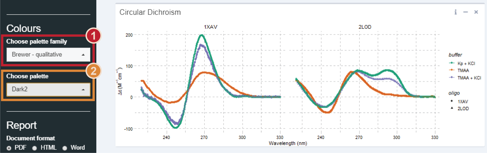
```
 
#### Right sidebars
 
Some figure boxes feature a _right sidebar_. They contain filtering and data formatting filters that are applied *only* on the corresponding figure (contrary to the _left sidebars_ that affect entire tabs). These sidebars are collapsible as well, and hidden by default.

## Consulting a database: the *database* tab

The database tab is dedicated to visualizing, exporting, and reporting on the data of a curated database file.

### Database input

The data from a given database must be gathered in a single .Rda file generated in the _importR_ tab. It contains five dataframes: one dedicated to the general oligonucleotide information (`db.info`), and the four other ones to each analytical technique (`db.CD`, `db.NMR`, `db.MS`, `db.UV`). 

*g4db* extracts automatically all the data, but it can also be loaded in the global environment (*i.e.* without using *g4db*) using `load()`. For instance, to load the demo database, run:

```{r load.demo.db.2, eval=FALSE, include=TRUE}
load(system.file("extdata/demo_database.Rda", package = 'g4dbr'))
```

The global environment should now contain five dataframes that can be opended and worked with. When using `g4db()`, the data will be loaded in the package environment and will therefore not appear in the global environment.

### Database use

#### Data loading

Upon opening the database file, the interface should be devoid of data. The first step is to import a database file:

1. Click on _Browse_ in the _Load_ section of the _left sidebar_ (Figure \@ref(fig:dbempty)),
2. Select a .Rda file that has been prepared in _importR_

```{r dbempty, echo=FALSE, fig.cap='Empty database view', out.width='100%'}
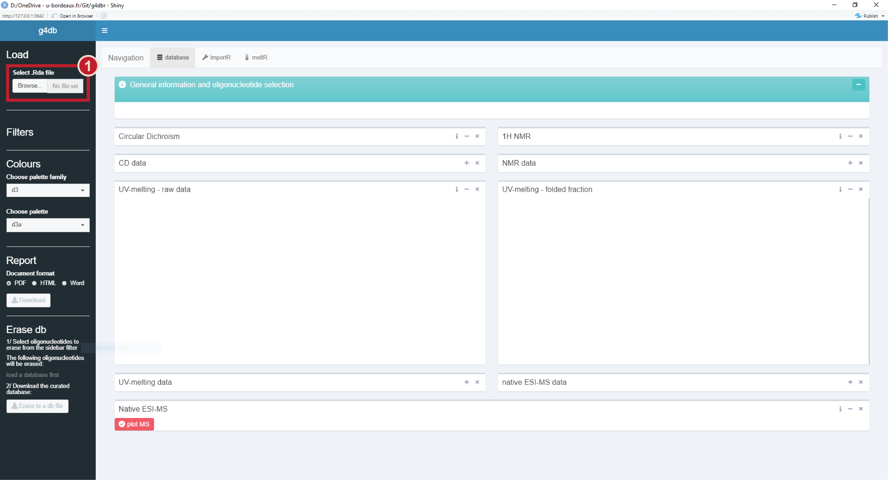
```

The _General information and oligonucleotide selection_ table should now be populated by a list of the oligonucleotides for which the database file contains at least information data (Figure \@ref(fig:dbimport)-1).

The content of this table is controlled by a drop-down menu in the *left sidebar*, and by the oligonucleotide column filter (in that order) (Figure \@ref(fig:dbimport)-2). By default, all oligonucleotides are shown, but none are selected for analytical result display (to avoid wait times when the table content is changed).

```{r dbimport, echo=FALSE, fig.cap='Demo database loaded in the *database* tab: the general oligonucleotide information should be displayed (1). The visible oligonucleotides can be filtered in the table or from the dropdown menu in the *left sidebar* (2). The table (1), and other tables in *g4db*, can be exported (a), their column visibility changed (b), and their content sorted, filtered or searched through (c)', out.width='100%'}
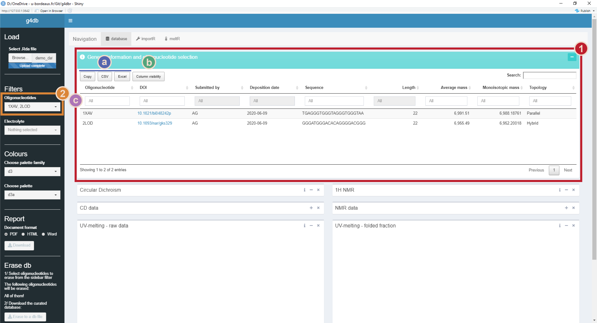
```

#### Data display

To start visualizing data, the _oligonucleotide(s)_ of interest must be selected from the *General information* table, by clicking on one or several rows (Figure \@ref(fig:dbselection)-1). Clicking again on a row deselects it.

The *CD*, *NMR* and *UV-melting* data should now be displayed (Figures \@ref(fig:dbselection)-2 and \@ref(fig:dbmassplot)-1). By default, the data aquired for all *buffer* conditions (i.e. all *cation* + *electrolyte*) are shown, but it can be restricted to only certan *buffers*, *electrolytes* or *cations*, using the menus from the *left sidebar* (Figure \@ref(fig:dbselection)-3). Individual *cation* and *electrolyte* selections supersede the *buffer* selection. For instance, if the buffers "TMAA + KCl" and "Kp + KCl" are selected, but the "Kp" electrolyte is excluded, then only "TMAA + KCl" will effectively be selected.

Note that the *buffers*, *electrolytes* and *cations* are not a static list, but are automatically collected from the _CD_ and _UV-melting_ data. It is therefore important to keep their naming consistent across the entire database.

```{r dbselection, echo=FALSE, fig.cap='Database data display: both oligonucleotides have been selected (1). Their data is displayed (2) but was buffer-filtered (3): only KCl-containing solutions are selected (a). Using the *right sidebar*, the *CD* data was panelled by *oligonucleotide* (b)', out.width='100%'}
knitr::include_graphics('ressources/database_selection.png')
```

The UV-melting data is displayed in two separate figures ((\@ref(fig:dbmassplot)-1)): on the left is shown the raw data with the fit line, and on the right is processed data. Depending on whether the data was processed by non-linear fitting or not, the processed data will either be the *folded fraction* or the absorbance normalized in [0,1]. This allows to plot the data of highly stable or unstable species on the same figure as those for which the *T<sub>m</sub>* could be determined. 

To also display MS data (\@ref(fig:dbmassplot)-2), the *Plot MS* button must be used \@ref(fig:dbmassplot)-3. This avoid long refresh times when selecting oligonucleotides. Any change in the *oligonucleotide*, *buffer*, *tunes*, *replicates*, and *m/z* selections will only be effective if the figure is replotted.

```{r dbmassplot, echo=FALSE, fig.cap='Database data display: UV-melting (1) and native MS (2) display. To display the MS data, the *Plot MS* button must be used (3)', out.width='100%'}
knitr::include_graphics('ressources/database_massplot.png')
```
For all these analytical methods, all data points are gathered in table, collapsed by default. These data points can be sorted, filtered, and exported in .xlsx or .csv files, or copied in the clipboard \@ref(fig:dbimport). Again, filtering data in the tables does **not** affects the figures, only the *left* and *right sidebars* do.

### Data content and customization

#### General information

This table gathers all the general information on the deposited oligonucleotides. By default, the following variables are displayed:

+ `Oligonucleotide` name, preferably a PDB code where available
+ `DOI`, with a hyperlink that is automatically generated upon importing with _importR_
+ `Submitted by`, the initials or full name of the data submission author
+ `Deposition date`, which is generated automatically by *g4db*
+ `Sequence`, the 5' to 3' oligonucleotide sequence
+ `Length`, the number of nucleotides, generated automatically by *g4db*
+ `Average mass` and `Monoisotopic mass` of the oligonucleotide, generated automatically by *g4db*, and used for the native MS peak labelling
+ `Extinction coefficient (260 nm)`, the molar extinction coefficient of the oligonucleotide (in M^-1^cm^-1^), calculated automatically by *g4db* (via the *epsilon.calculator*)
+ `Topology`, a short user-supplied description of the oligonucleotide structure (e.g. *parallel quadruplex*)

The fields hidden by default (nucleotide and atom numbers) are not of direct interest to the general user, but can be displayed using the *column visibility* button.

Importantly, this table is used to select the oligonucleotide for which the analytical data should be displayed, as shown in Figure \@ref(fig:dbselection). It is possible to quickly filter through entries by e.g. topology or length, to select all oligonucleotides falling in a given category.

#### Circular dichroism

The data is shown as points and lines, colored by *buffer*. The *oligonucleotides* are differentiated by point shape. 

The *right sidebar* contain the following settings:

+ *normalized* switch: choose to display molar ellipticities (as automatically calculated in *importR*; default) or raw data (i.e. in mdeg).
+ *superimposition* dropdown menu: choose to display all data superimposed (default), grouped in panels by *oligonucleotide* or *buffer*, or not superimposed at all.
  + The figure size will automatically adjust with the number of panels
+ *scale* dropdown menu: select whether all panels must have the same y-axis scale (*not free*) or can be rescaled to better fit their content (*free*)
+ *Wavelength* slider: select the wavelength range to display (default: 220-330)
+ *point size* and *line size* sliders: adjust the size of points and lines
+ *transparency* slider: adjust the transparency of both points and lines

The data is gathered in the *CD data* table below, which can be sorted, filtered, and exported. The fields displayed by default are `Oligonucleotide`, `Buffer`, `Wavelength (nm)`, `CD (mdeg)`, and `Delta epsilon (M-1cm-1)`. The other fields hidden by default can be displayed using the *column visibility* button.

#### 1^H^ NMR

The data is shown as a line, colored by *oligonucleotide*, and is normalized so that all spectra will share the same y-axis range. By default, each spectrum is shown in its own panel. Peak numbers are shown above their peaks and linked by a segment.

The *right sidebar* contains some settings identical to the CD one (*superimposition*, *scale*, *line size*). In addition, it contains a *chemical shift (ppm)* slider to select the chemical shift range to display (default: 10-12.5 ppm).

The data is gathered in the *NMR data* table below, which can be sorted, filtered, and exported. The fields displayed by default are `Oligonucleotide`, `Buffer`, `Chemical shift (ppm)`, and `Intensity`. The other fields hidden by default can be displayed using the *column visibility* button.

#### UV-melting 

UV-melting data is plotted with points, and in the case of the raw data with an additional fit line.

The *right sidebar* contains some settings identical to some described above (*point size*, *line size*, *line transparency*). In addition, it contains a *Temperature (K)* slider to select the temperature range to display (default: 278-368 K).

The data is gathered in the *UV-melting data* table below, which can be sorted, filtered, and exported. The fields displayed by default are `Oligonucleotide`, `Buffer`, `ramp`, `T (K)`, `Folded fraction`, and `Absorbance`. The other fields hidden by default can be displayed using the *column visibility* button.

#### Native mass spectrometry

The mass spectrometry data is shown as line (Figure \@ref(fig:dbmslayout)). By default, spectra are panelled by *oligonucleotide* (columns) and *buffer* (rows), which should typically lead to a single spectrum per panel. Peak labels appear above their corresponding peak. Zooming in might be necessary to see all peaks

Besided a *line size* slider, the *right sidebar* contains:

+ *m/z* slider: select the *m/z* range to display (default: 800-2500 *m/z*).
+ *Tunes* dropdown menu: select the *tunes* to display.
  + *tunes* are collected automatically from the data
+ *Replicates* dropdown menu: select the *replicates* to display
  + *replicates* are collected automatically from the data
+ *Layout* dropdown menu: select a panel layout among all combinations of *oligonucleotide*, *tune*, *buffer*, and *replicate*
  + Six unique combinations can be selected, and the six other ones are accessed using the *transpose grid* switch
  + If more than one spectrum appears on a panel, the two variables that are not mapped by the layout are combined to be mapped as colours
+ *labels* slider: choose whether to show (default) or hide labels

```{r dbmslayout, echo=FALSE, fig.cap='Detail of native MS data panelled with *oligonucleotides* in columns (a) and *tunes* in row (b). Because several spectra are superimposed, the remaining variables (*replicate* and *buffer*) are combined to map colors (c)', out.width='100%'}
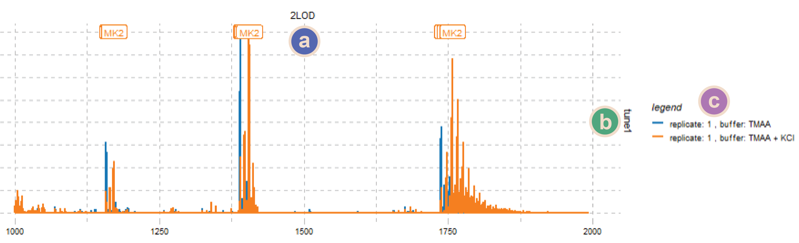
```

The data is gathered in the *native ESI-MS data* table above, which can be sorted, filtered, and exported. The fields displayed by default are `Oligonucleotide`, `Buffer`, `Tune`, `Replicate`, `m/z`, `Normalized intensity`, and `Intensity`. The other fields hidden by default can be displayed using the *column visibility* button.

The table may take some time to load given the large number of data points.

### Reporting

#### Report generation

Reports can be generated from the displayed data, either *full* (with traceability features, titles,...), or *SI* (with minimal information to avoid redundancy when reports are collated into a supporting information document), in Word, pdf, and HTML formats, in a few simple steps:

1. Select the *oligonucleotide(s)* for which the report must be generated,
2. Plot the MS data, if they are to be included in the report. If not, the section will not appear in the report,
3. Customize, where necessary, the figures (e.g. colours, scales),
4. Select the report type (*full* or *SI*) with the *Report type* switch, 
5. Select a document format (Word, pdf, HTML), in the *left_sidebar* (*Report* section)
6. Click on the *Download* button and save the document.

#### Word formatting

The Word format uses a template file to define its appearance (i.e. the styles). This template file can be changed by the user to generate reports directly with the desired appearance, to avoid additional work outside of *g4db*.

The template is located in the *markdown* folder of the *g4dbr* package. To locate the template, run:

```{r find.temp, eval=FALSE, include=TRUE}
system.file("rmarkdown/word-styles-reference.docx", package = "g4dbr")
```

Then, modify the **styles** as desired. Local text modifications will **not** be taken into account.

It is also advised to back up this file in another location, because any new install or update will overwrite it.

### Data deletion

It is possible to selectively remove data from the database, by oligonucleotide and analytical method, using the *database.eraser* function implemented within *g4db*.

Several oligonucleotides can be processed at once, if the same analytical methods to remove are selected. If all analytical methods are selected, the selected oligonucleotide(s) entries will be entirely purged (including the general information).

In some cases, it is not good practice to ever delete data from a database. <ins>If the use of *g4db* lies within these cases do not use the data deletion tool as it **permanently deletes data**</ins>. Here, the data deletion tool was mostly provided as a mean to correct and update data *cleanly*, as the new data might not be written to the database if a duplicate record already exists. It is also a way to generate lighter, sub-databases for specific uses, by discarding all irrelevant entries.

By default, a new file will be generated, named `Modified database-YYYY-MM-DD.Rda`, where `YYYY-MM-DD` is the date of the day, so as to avoid accidental file overwriting.

To delete one or several entries:

1. Select the *oligonucleotide(s)* to delete from the dropdown menu in the *left_sidebar* (**not from the _general info table_**),
2. Select the *methods* for which the data must be removed, by flipping the switches on,
3. Click on *Erase to a db file*
4. Save the file (with a different name than the one in use)
5. Optional: load the new database file for verification and further use

For more details on the *database.eraser* function, refer to the *Other functions and reference files* section.

## Importing data in the database: the *importR* tab

### Templated-Excel file

Before importing data into a database file using *g4db*, it is necessary to paste this data into a provided Excel template file. Once filled, this file doubles as a data repository that can be explored in other pieces of software. Note, however, that such files can become quite heavy (in particular with MS data), leading to very slow loading and saving times, and high memory use. 

The Excel file is divided into seven tabs that contain raw data (*UV*, *CD*, *NMR*, *MS*), general oligonucleotide information (*info*), or peak labeling data (*NMR* and *MS* *labels*). It is essential to maintain consistency throughout the file to ensure that the data and labels are read and associated correctly: *oligonucleotide*, *electrolyte*, *cations*, *tunes* and *replicate* must be named identically across columns and tabs. If the data is to be appended to an existing database, the naming scheme must be extended to the new data. In particular, attention should be paid about capitalization (e.g. 'TMAA' vs 'tmaa' vs 'Tmaa') and typical name variants (e.g. 'Kp' vs. 'Kpi').

The template is installed with the package. Its location can be obtained by running:

```{r demo.input, eval=FALSE, include=TRUE}
system.file("extdata/demo_input.xlsx", package = 'g4dbr')
```

After adding data, do **not** save the file in this folder, as it would be overwritten by a package update, and deleted upon package removal.

#### info

The first tab gathers essential data on the entries to submit (Figure \@ref(fig:demoinputinfo)). Five fields must be filled, i.e.: 

+ `oligo`, the name of the oligonucleotide, preferably a PDB code where available,
+ `sequence`, in the 5' to 3' direction, without spaces or dashes,
+ `submitted_by` the initials or full name of the data submission author,
+ `DOI` is the DOI of the paper linked to the PDB deposition. Paste the DOI only, and not a full link, which will be automatically generated by *importR*
+ `Topology`, a short user-supplied description of the oligonucleotide structure (e.g. *parallel quadruplex*).

```{r demoinputinfo, echo=FALSE, fig.cap='Info template', out.width='80%'}
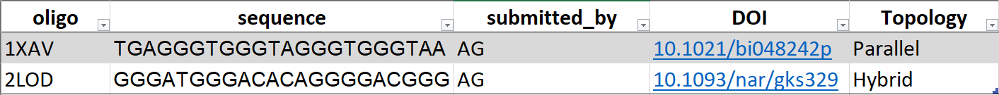
```

All the other fields that can be seen in the corresponding tables in *g4db* are calculated automatically.

#### CD

The *CD* data must be pasted in two columns, below the header, with the `wavelength` in the first column and the `ellipticity` in mdeg in the second column (Figure \@ref(fig:demoinputcd)). 

The `oligonucleotide`, `buffer` and `cation` names, the cuvette `path length` in cm, and the `oligonucleotide concentration` (in µM) must be supplied in the header rows.

For every new data set (new *oligonucleotide*/*buffer*/*cation* combination), the next two columns must be used and so forth. Even if the wavelength axis is the same, it must be specified again; this allows dealing with mismatched axes (see the right-hand side columns in Figure \@ref(fig:demoinputcd)).

```{r demoinputcd, echo=FALSE, fig.cap='CD template. Four spectra are shown. Note that one of the x-axis is mismatched', out.width='100%'}
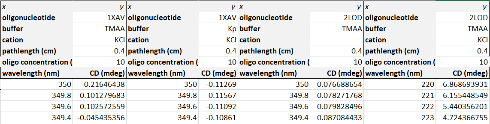
```

#### UV-melting

The *UV-melting* tab is the only one where three columns must be filled for each *oligonucleotide*/*buffer*/*cation* combination:

+ `Temperature`, is the solution temperature, in °C or K (*importR* determines which automatically),
+ `Absorbance`, is the absorbance of the solution, with or without blank subtraction (blank subtraction can be performed in *importR*)
+ `Blank`, is the absorbance of the reference blank solution to subtract, where necessary.

Besides the `oligonucleotide`, `buffer` and `cation` names, the header contains a `replicate` field, to increment when several experiments for the same *oligonucleotide/buffer/cation* combination are submitted.

```{r demoinputuv, echo=FALSE, fig.cap='UV-melting template. Case where the data is already blank-subtracted', out.width='100%'}
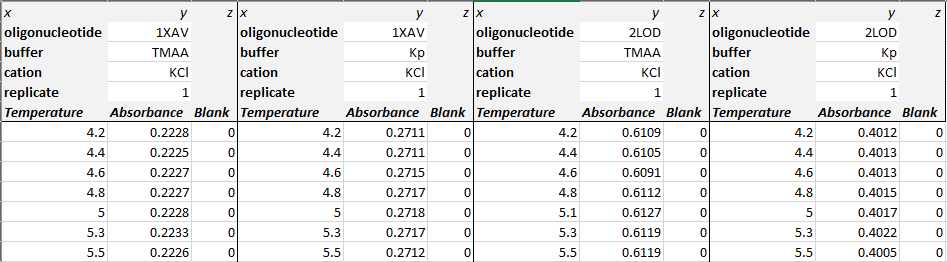
```

The melting data must be pasted as is, in particular if both cooling and heating ramps are recorded successively. *MeltR* uses the changes in temperature (increase or decrease) from successive rows to assess whether it deals with a heating or cooling ramps, and eventually dissociates both for further processing.

#### NMR

The *^1^H-NMR* template follows the same principle as the *CD* one: two columns (per *oligonucleotide*/*buffer*/*cation* combination) for the chemical shift and intensity, and three header rows for the `oligonucleotide`, `buffer` and `cation` names (Figure \@ref(fig:demoinputnmr)). 

```{r demoinputnmr, echo=FALSE, fig.cap='NMR template', out.width='50%'}
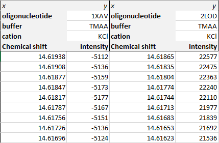
```

#### NMR labels

This tab is used to submit ^1^H NMR peak labelling information (Figure \@ref(fig:demoinputnmrlabs)). The header structure is the same than in the NMR data tab. The first column must be filled with `peak` numbers, in any order, with the corresponding `chemical shifts` in the second column. The labels are handled as text, and therefore several numbers can be submitted for a single chemical shift value.

As a sidenote, it is possible to keep cells empty if a given peak number is in the list but there is no corresponding peak in the spectrum. This is practical when several spectra are being labelled and a common peak number list is used. Note that the peak list must be repeated for all spectra, even if they are identical.

```{r demoinputnmrlabs, echo=FALSE, fig.cap='NMR labels template. Note that both oligonucleotides have completely different labellings', out.width='50%'}
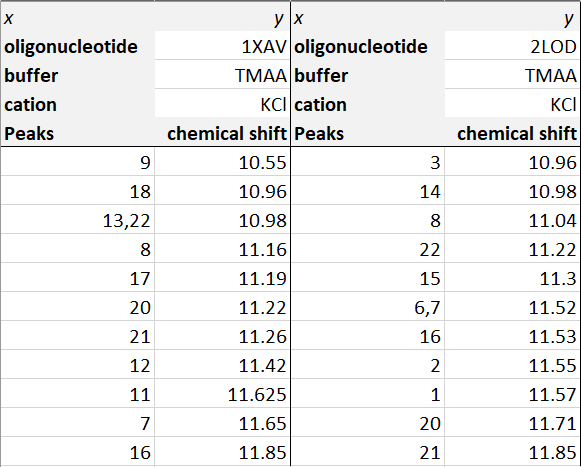
```

Make sure to mirror the header from the NMR data tab, so that all spectra are labelled.

#### MS

The MS template shares the same structure as _NMR_ and _CD_, with `m/z` and the `intensity` as columns one and two (Figure \@ref(fig:demoinputms)). The intensity can be supplied normalized or not, it will eventually be normalized in *importR*. Two additional header rows must be filled: 

+ `tune`, a short name identifying the MS parameters. The name must be linked to said parameters along the database file (e.g. publication, readme file).
+ `replicate`, a number to increment when several experiments for the same *oligonucleotide/buffer/cation/tune* combination are submitted.

```{r demoinputms, echo=FALSE, fig.cap='MS template', out.width='80%'}
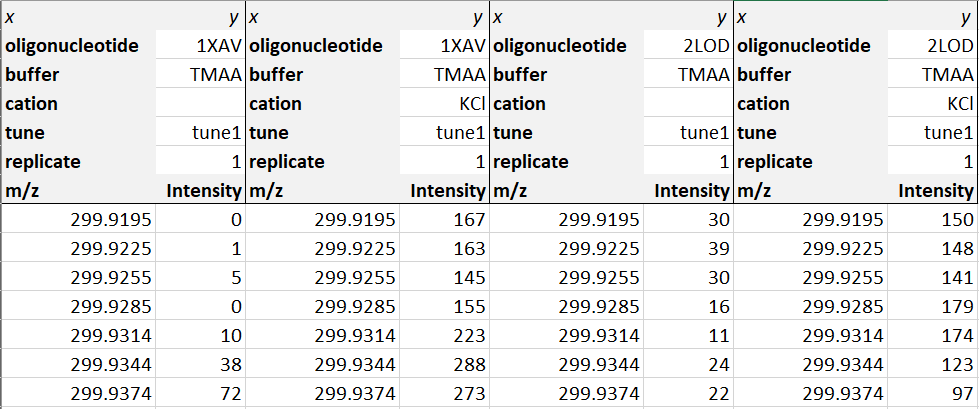
```

It is advised to be relatively conservative with data-heavy spectra to cut on processing time in *importR*, e.g. irrelevant m/z ranges can be discarded. In case of doubt, everything can be kept at this stage and filtered later on in *importR*.

#### MS labels

This tab is aimed at providing the database with the **nature** of the species to label in the MS spectrum, <ins>not</ins> their `m/z`. It therefore differs from the NMR label tab, where one must supply the `chemical shift` of each label. 

The first column contains charge state number, to label different charge states independently (Figure \@ref(fig:demoinputmslabs)). The second column contains the name of the species to be labelled, which must be supplied using the following syntax: _M_ for the non-adducted oligonucleotide, *MK* for a single-potassium-adduct species, *MK2* for a two-potassium-adduct species, and so forth (up to ten). 

```{r demoinputmslabs, echo=FALSE, fig.cap='MS labels template. Note the difference in labelling between oligonucleotides and buffer. Both charge states have been labelled the same however', out.width='67%'}
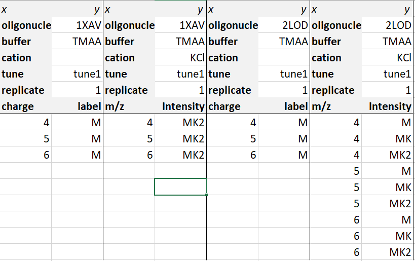
```

Make sure to mirror the header from the MS data tab, so that all spectra are labelled.

### Populating a database

Once the template file is ready, the data can be loaded in *g4db*, processed, filtered, and written into a new or existing database file. All of these steps can be performed in the *importR* tab, except for the *UV-melting* data treatment that is carried out in *meltR* (see the [Importing UV-melting data: the *meltR* tab](#meltr) section).

Essentially, *importR* works just like *database*. The main window hosts the same data tables and figures than database (except *UV-melting* figures), with the same functioning (data filtering, figure customization). In the same vein, the *left sidebar* also contains the filters and color palette selection menus. All these common features are described in the *Interface overview* and *Consulting a database: the database tab* sections, and will not be discussed below.

The key aspect of *importR* is that it is a *selective* database writing tool. In that context:

+ **What you see is what you write** to the database. Any data point filtered out (whether by *oligonucleotide*, *buffer* compositon, x-axis range), will *not* be written in the database file.
+ Duplicated data points (same technique, *oligonucleotide*, *buffer* composition, x-axis position,...) are discarded. For instance, resubmitting data with a wider x-axis range will have the effect of completing the database (without doubling the already existing points), but resubmitting corrected data on the same range might not replace the initial data. It is therefore better to first remove the erroneous entry (see the [Data deletion](#data-deletion)). 
+ Individual oligonucleotides and analytical methods can be included or excluded from the database writing.

#### Template file input

The data is imported by selecting a file via the *Browse...* button in the *left sidebar*. 

#### Data filtering and processing

Oligonucleotides are selected from the *General information* table. Further buffer composition filtering can be performed in the *left sidebar*. 

The *CD* and *NMR* calculations (e.g. normalization, labeling) and plotting are automatically performed, without any user input. The MS data is processed and plotted when the *plot MS* button is clicked. Note that if the MS data is not plotted, it cannot be exported to a database.

Method-dependent *filtering* is performed in the corresponding *right sidebars*, as described for the *database* tab.

#### Importing UV-melting data: the *meltR* tab

The processing of UV-melting data is performed in *meltR*, a distinct tab from *importR*, to avoid overcrowding the interface and allow its use outside of the database frame.

The data is sourced from the template file loaded in *importR*, and once the data is processed in *meltR* it can be sent back to *importR* to include in the database. Note that the filtering of temperature range and buffer composition must be performed directly in *meltR*.

The use of *meltR* itself is described below.

### Writing a database file

Once the data has been selected and properly filtered (including or not UV-melting data from *meltR*), it can be written into a database file in three simple steps:

1. Select a database file, either an existing one (to add new entries) or an empty one (to create a new database). This file can be opened in the *Export* section of the *left sidebar* of *importR*, or from the *database* tab. In either way, the data can be consulted in the *database* tab. An empty file is available in the package, and can be found by running:

```{r empty.db, eval=FALSE, include=TRUE}
system.file("extdata/empty_database.Rda", package = 'g4dbr')
```

2. Select the methods to write to the database file, using the switches. The MS and UV-melting data must be generated to be exported.
3. Click on *Write to db file*. By default, the file will be named following the `Database-YYYY-MM-DD.Rda` template. Rename where necessary. <ins>If the database in use was generated the same day than the deletion operation, there is a risk of it being overwritten: make sure to name the new file with a different name</ins>.
4. Optional: load the new/updated database to verify that the import worked correctly.

## Automated processing of UV-melting data: the *meltR tab* {#meltr}

### Principle

#### Purpose

*meltR* is an automated UV-melting data processing software. It determines the melting temperatures ($T_{m}$), $\Delta G^0$, $\Delta H^0$ and $\Delta S^0$ by non linear fitting, then converts the absorbances into folded fractions.[@Mergny2003] 

Folded fractions are a good way to assess to which extent an oligonucleotide is structured (1: all molecules folded, 0: all molecules unfolded), visually observe the $T_{m}$ (folded fraction = 0.5), and normalize the data to different oligonucleotides in different experimental conditions to a common y-scale.

For the non-linear fitting and the folded fraction calculation to work, the data <ins>must contain both a *lower* and *higher* baseline</ins>.[@Mergny2003] In other words, the oligonucleotide must not be too stable or too unstable. In such cases, *meltR* allows to normalize the data to [0;1] to at least bring all data to a common y-scale.

#### Data modeling: General model

In a melting experiment, changes in the solution temperature lead to changes in the amount of folded (decreases with increasing temperatures) and unfolded species (increases with increasing temperatures). The model relies on the expression of the measured absorbance $A_T$ as the sum of the absorbances from the folded (*F*) and unfolded (*U*) forms, weighted by their abundance expressed from the folded fraction $\theta _T$.

$$A_T=A_T^F \times \theta _T + A_U^T \times (1-\theta _T)$$

The folded fraction is defined by $\theta = \frac{[F]}{[F]+[U]}$. Assuming a simple (and possibly oversimplified) two-state model $F \Leftrightarrow U$ with an equilibrium constant $K$, $\theta$ can be expressed as:
$$\theta = \frac{1}{1+K}$$

This leads to:
$$A_T=A_T^F \times \frac{1}{1+K} + A_U^F \times \frac{K}{1+K}$$
$A_T^F$ and $A_T^U$ can be modelled as a linear function of the temperature, where $a$ is the slope and $b$ the intercept of these baselines:

$$A_T=(a^FT+b^F) \times \frac{1}{1+K} + (a^UT+b^U) \times \frac{K}{1+K}$$

$K$ can be expressed by thermodynamic quantities of interest: $\Delta G^0$, $\Delta H^0$ and $\Delta S^0$. 

$$-RTlnK = \Delta G^0 = \Delta H^0 - T\Delta S^0$$
Note that in meltR, potential changes in heat capacity changes in the evaluated temperature range are not taken into account to avoid over-paramaterization. At the melting temperature: 

$$ \Delta G_m^0 = \Delta H_m^0 - T\Delta S_m^0 = 0 $$

Which leads to:

$$\Delta S_m^0 = \frac{\Delta H_m^0}{T_m} $$
And therefore:

$$\Delta G^0 = \Delta H^0_{m} (1- \frac{T}{T_m})$$

Finally, K can be expressed as $exp(-\frac{\Delta H^0 (1- \frac{T}{T_m})}{RT})$, yielding:

$$A_T=(a^FT+b^F) \times \frac{1}{1+exp(-\frac{\Delta H^0 (1- \frac{T}{T_m})}{RT})} + (a^UT+b^U) \times \frac{exp(-\frac{\Delta H^0 (1- \frac{T}{T_m})}{RT})}{1+exp(-\frac{\Delta H^0 (1- \frac{T}{T_m})}{RT})}$$

#### Data modeling: Implementation and derived values

In meltR, the absorbance is converted to molar extinction coefficients before fitting with the following model (code simplified for readability):

```{r echo=TRUE, eval=FALSE}
epsilon = (P3+P4*T)*1/(1+exp(-P1*(1-T/P2)/(8.31451*T))) +
  (P5+P6*T)*exp(-P1*(1-T/P2)/(8.31451*T))/(1+exp(-P1*(1-T/P2)/(8.31451*T)))
```

where *epsilon* is the molar extinction coefficient, *T* is the temperature (in Kelvin), `P1` is $\Delta H^0$, `P2` is the $T_m$, `P3`/`P5` and `P4`/`P6` are respectively the origins and slopes of the baselines. The optimized parameters are summarized in the *meltR* tab, and can be later consulted in the *database* tab.

The non-linear fitting is performed with the base function `nls()`. Below is a more detailed view of the fitting model, applied on a demo data melting curve of *1XAV* (Figure \@ref(fig:demomelt). Note that some user inputs have been hard-coded:

```{r demomelt, fig.cap='Melting curve of 1XAV (cooling ramp) in 100 mM TMAA + 1 mM KCl, from the demo database', fig.width=5, fig.height=3}
library(tidyverse)
library(ggthemes)

#loading the demo data
load(system.file('extdata/demo_database.Rda', package = 'g4dbr'))

#Experimental conditions
melt.c <- 10 #oligo at 10 micromolar
melt.l <- 1 #cuvette with 1.0-cm path length

#Selection of a melting curve from the demo data
data.to.fit <- db.UV %>%
  select(oligo, buffer, cation, rep, comment, ramp, id, T.K, abs.melt) %>%
  filter(oligo == '1XAV' & buffer == 'TMAA' & ramp == 'cooling') %>%
  mutate(abs.melt = abs.melt/(melt.c/1E6 * melt.l)) #conversion to epsilon

#Plot
data.to.fit %>%
  ggplot() +
  geom_point(aes(x = T.K, y = abs.melt), color = 'steelblue') +
  theme_pander() +
  xlab("T (K)") +
  ylab("epsilon")
```

```{r}
#Fit initialization (fully hard coded here for simplicity's sake)
P1s <- 130000
P2s <- 325 #extracted from the first derivative normally
P3s <- 1/(melt.c/1E6 * melt.l) #denominator converts initial parameters to molar abs coeff.
P4s <- 0.30/(melt.c/1E6 * melt.l)
P5s <- 0/(melt.c/1E6 * melt.l)
P6s <- -0.2/(melt.c/1E6 * melt.l)


#Non-linear fitting
ms <- nls(
  data=data.to.fit,
  data.to.fit$abs.melt~(P3+P4*data.to.fit$T.K)*1 / (1+exp(-P1*(1-data.to.fit$T.K/P2) / (8.31451*data.to.fit$T.K)))+
    (P5+P6*data.to.fit$T.K)*exp(-P1*(1-data.to.fit$T.K/P2) / (8.31451*data.to.fit$T.K))
  / (1+exp(-P1*(1-data.to.fit$T.K/P2) / (8.31451*data.to.fit$T.K))),
  start = list(P1 = P1s, P2 = P2s, P3=P3s, P4=P4s, P5=P5s, P6=P6s), #initial parameters
  nls.control(maxiter = 5000, #default value, hard-coded here but users can modify it
              warnOnly = T)
)

#Optimized parameters
fit.output <- data.frame(
  nb.data.pt = nobs(ms),
  RSS = sum(residuals(ms)^2),
  SE.residual = sigma(ms),
  P1 = as.vector(coef(ms))[1],
  P2 = as.vector(coef(ms))[2],
  P3 = as.vector(coef(ms))[3],
  P4 = as.vector(coef(ms))[4],
  P5 = as.vector(coef(ms))[5],
  P6 = as.vector(coef(ms))[6]
)

fit.output

```

Note that the residual sum of squares (RSS) and standard error of residuals (RMSE) are computed.

After the fitting is complete, a number of derived values are calculated. The $\Delta H$ and $\Delta S$ of the folding reaction are obtained from `P1` and `P2`.

```{r}
#Temperature at which the free energy is calculated
temp = 293 #a user input normally

DeltaH = -as.vector(coef(ms))[1]
DeltaS = -as.vector(coef(ms))[1]/as.vector(coef(ms))[2]
DeltaG = DeltaH - temp * DeltaS

data.frame(DeltaH, DeltaS, DeltaG)

```

The baselines (in M^-1^cm^-1^) are obtained with `P3+P4*T` and `P5+P6*T` (Figure \@ref(fig:baseplot):

```{r baseplot, fig.cap='The baselines are not determined manually, but computed from the fitting parameters', fig.width=5, fig.height=3}
data.to.fit %>%
  mutate(low.T.baseline = fit.output$P3+fit.output$P4*T.K,
         high.T.baseline = fit.output$P5+fit.output$P6*T.K) %>%
  ggplot() +
  geom_point(aes(x = T.K, y = abs.melt), color = 'steelblue') +
  geom_line(aes(x = T.K, y = low.T.baseline), color = "coral", size = 1) +
  geom_line(aes(x = T.K, y = high.T.baseline), color = "coral", size = 1) +
  theme_pander() +
  xlab("T (K)") +
  ylab("epsilon")
```

The folded fraction (Figure \@ref(fig:foldedfractionbase) is calculated by deconvoluting the baseline contributions: 

$$\theta = \frac{P6T + P5 - \epsilon}{P6T+P5-(P4T + P3)}$$
```{r foldedfractionbase, fig.cap='The folded fraction of 1XAV (cooling ramp) in 100 mM TMAA + 1 mM KCl', fig.width=5, fig.height=3}
data.to.fit %>%
  mutate(folded.fraction.model = (fit.output$P5+fit.output$P6*T.K-abs.melt)/(fit.output$P5+fit.output$P6*T.K - fit.output$P3-fit.output$P4*T.K)) %>%
  ggplot(aes(x = T.K, y = folded.fraction.model)) +
  geom_point(color = "steelblue") +
  theme_pander() +
  xlab("T (K)") +
  ylab("epsilon")
```


The modeled folded fraction (Figure \@ref(fig:foldedfraction)) is also derived from the fit, using:

$$\theta_{model} = \frac{1}{1 + exp(-\frac{P1(1-\frac{T}{P2})}{RT})}$$.


```{r foldedfraction, fig.cap='The modeled folded fraction of 1XAV (cooling ramp) in 100 mM TMAA + 1 mM KCl', fig.width=5, fig.height=3}
data.to.fit %>%
  mutate(folded.fraction = 
           (1/(1+exp(-fit.output$P1*(1-T.K/fit.output$P2)/(8.31451*T.K))))) %>%
  ggplot(aes(x = T.K, y = folded.fraction)) +
  geom_point(color = "steelblue") +
  theme_pander() +
  xlab("T (K)") +
  ylab("epsilon")
```

#### Workflow


The data is processed following this workflow:

1. Detection of the temperature unit, and conversion to Kelvin where necessary, 
2. Generation of a unique `id` for each *oligonucleotides*, *ramps*, *buffers*, and *replicates* combinations. From then on, all data is processed by `id` (in particular cooling and heating ramps are processed separately).
3. Blank subtraction, if blank data is submitted (can be turned off),
4. Conversion of the absorbance data to molar extinction coefficient,
5. Determination and separation of the ramps (cooling and heating). The ramps are always processed separately.
6. Data selection from user input: *oligonucleotides*, *ramps*, *buffers*, *replicates*, or individual *id*.

The steps 7--9 are only carried out if the data can be fitted (presence of both lower and upper baselines):

7. Non linear fitting initialization
    a. `P2` (the *T<sub>m</sub>*) is initialized as the maximum of the first derivative ($\frac{\Delta\epsilon}{\Delta T}$)
    b. All other parameters initial values are hard-coded, and modulated by the oligonucleotide concentration and cell path length
    c. Manual user modification
8. Non linear fitting (see model above),
9. Calculation of the folded fractions (from experimental data and from the model) and baselines (see equations above)

Step 10 is only carried out for non-fittable data:

10. The $\epsilon$ values are normalized in the [0;1] range, to be displayed alongside folded fraction data (same y-scale).

### Data loading and filtering

The data must be loaded from the Excel template into *importR*. All of the UV-melting data is automatically imported into *meltR*, regardless of the oligonucleotides selected in *importR* (to facilitate the standalone use). However, only the processed data for the oligonucleotides selected in *importR* is sent back to that tab.

The *meltR* interface has a slightly different organization than *importR* and *database*: the filtering of data to process is carried out in the hovering *Filter* panel (Figure @\ref(fig:melting1)).

1. Where necessary, refine the temperature range (default: 276-363 K, or ~ 3-90 °C),
2. Select the oligonucleotides to process (default to all). It is possible to process several oligonucleotides at once. Remember however that, in the context of *g4db*, these different oligonucleotides need to be selected in *importR* to be sent to that tab.
3. Select the ramps (heating or cooling) to process (default: both). The nature of the ramps is determined automatically, and the ramps are processed separately.
4. Select the buffers to process (default: all),
5. Select the replicates to process (default: all)
6. If the steps 2--5 do not allow to specifically select the desired data, it is possible to directly filter the data by `id`.

```{r melting1, echo=FALSE, fig.cap='The UV-melting data from the demo input, where the Kp+KCl buffer was filtered off', out.width='90%'}
knitr::include_graphics('ressources/melting_1.PNG')
```

The *Filter* panel can be minimized by clicking on the header.

### Data fitting

This section can be carried out only for data that can be fitted. For non-fittable data, skip this section.

1. Click on the *Plot derivative* button, located in the *left sidebar*. 
    a. The *Input data* box will automatically switch to display $\frac{\Delta\epsilon}{\Delta T}$ (Figure \@ref(fig:melting2))
    b. The *Approximate T<sub>m</sub>* table is filled with the maxima from the derivatives, in the *Fit* box.   
    c. Artifactual points (e.g. caused by important local data variations) may lead to erroneous approximated *T<sub>m</sub>*: increase the smooth window and click on the button again. If the results are still not satisfactory, continue anyway to step 2 (Figures \@ref(fig:melting2) and \@ref(fig:melting3)).
    
```{r melting2, echo=FALSE, fig.cap='First derivative data was obtained by clicking on Plot derivatives. Note the presence of artifacts at high temperature that will cause an erroneous initialization to the Tm for 1XAV-TMAA + KCl-heating-1', out.width='100%'}
knitr::include_graphics('ressources/melting_2.PNG')
```

```{r melting3, echo=FALSE, fig.cap='T<sub>m</sub> initialization from first derivative data. Here, the second entry is erroneous and must be corrected either by increasing the derivative smoothing, or manually at the next step', out.width='100%'}
knitr::include_graphics('ressources/melting_3.PNG')
```   
    
    
2. Click on the *Initialize fitting button*, located in the *left sidebar* (Figure \@ref(fig:melting4)).
    a. The *Fit* box will automatically switch to the *Fit initialization* table.
    b. If step 1. was not satisfactory, manually correct the `Tm.init` variable. <ins>Correctly initialized *Tm* are critical for the success of the fitting process </ins> The other initial fitting parameter values can also be modified.
    c. If desired, change the legend; by default it is the `id`
    
```{r melting4, echo=FALSE, fig.cap='Fitting initialization. All parameters are initialized. Note that the Tm initialization is being manually corrected', out.width='100%'}
knitr::include_graphics('ressources/melting_4.PNG')
```   
  
    
3. Click on the *Launch fitting* button (Figure \@ref(fig:melting4)), and the data will be processed and the result displayed in several figures and tables (Figure \@ref(fig:melting5)).
   a. The *Fit* box will automatically switch to the fit result tab, showing the fit lines and calculated baselines. Baselines can be toggled off using the corresponding switch in the *left sidebar*.
    b. The folded fractions (and modeled folded fraction) are shown in the *Fit results* box
    c. The melting temperatures and other thermodynamic values are accessible in the *Melting temperatures* box. The temperature at which the Free energy is calculated can be adjusted from a slider in the *left sidebar*. The *T<sub>m</sub>* values are also plotted in the *Plot* tab (box plot grouped by *oligonucleotide* and *buffers*, with distinctive colors per ramp).
    d. If the fit fails, it is likely that the data was not correctly initialized. Change the parameters, and click again on *Launch fitting*.
    e. Where necessary, the maximum number of iterations can be increased (slider in the *left sidebar*; default: 5000).
    
```{r melting5, echo=FALSE, fig.cap='Fitting results: Fitted data (top right), folded fraction (bottom left), data table and Tm plot (bottom right)', out.width='100%'}
knitr::include_graphics('ressources/melting_5.PNG')
``` 
  
### Sending data to *importR*

To send data to *importR* for database edition:

1. If not already done, select the oligonucleotides to import in *importR* from the *General information* table of that tab,
2. Select whether the data was fitted or not with the *select data* switch, in the *left sidebar*,
3. Click on the *send to importR* button,
4. In *importR*, verify that the data has correctly been sent into the *UV-melting data* box.

  
### Figure customization

The choice of colour palettes, lines and points size and transparency, can be made from the hovering *Customisation* panel. The panel can be minimized by clicking on the header. 

# Other functions and reference files

## epsilon.calculator

### Principle

`epsilon.calculator` relies on the 'traditional' format of the nearest-neighbor model for extinction coefficient calculation, applied at 260 nm.[@Cantor1970; @Tataurov2008]

$$\epsilon_{260nm} = \sum_{i=1}^{N_b - 1}\epsilon_{i, i+1} - \sum_{i=2}^{N_b - 1}\epsilon_{i}$$

To that effect, it uses `epsilondb`, a database of reference $\epsilon_{260 nm}$ contributions from the individual nucleobases, and couples of nucleobases (neighboring effects):

```{r epsilon.db}
epsilondb
```

epsilon.db is contained within the `[installpath]/data/Rdata.rds` file after the package is built. The value may be modified from the `[installpath]/extdata/referencedb.xlsx` but requires to rebuild the package.

### Code

The code of `epsilon.calculator` is contained in `R/EpsilonCalc.R`

First, the list of nucleobases and their nearest 3' neighbour are extracted from the user-supplied sequence (here 5'-GCAT-3'):

```{r sequence.read}
library(stringr)
library(tidyverse)

#sequence provided by the user
sequence <- 'GCAT'

#initialization of result data frame
epsilon.calc <- data.frame()
buffer <- data.frame()
result <- data.frame()

#extraction of individual bases and their 3' nearest neighbor
for (i in 1:str_length(sequence)) {
  buffer <- data.frame(position = i,
                       nucleo = substr(sequence, i, i),
                       nn = substr(sequence, i+1, i+1)
  )
  epsilon.calc <- rbind(epsilon.calc, buffer)
}

epsilon.calc
```

Their contribution are then attributed by matching their one letter code to the database, and both the 5' and 3' ends have their individual contributions set to zero.

```{r contribution}
#attribution of individual and nearest neighbor contributions
  epsilon.calc <- epsilon.calc %>%
    mutate(
      indiv.base.cont = case_when( #individual
        nucleo == 'G' ~ epsilondb$epsilon[epsilondb$base == 'G'],
        nucleo == 'C' ~ epsilondb$epsilon[epsilondb$base == 'C'],
        nucleo == 'T' ~ epsilondb$epsilon[epsilondb$base == 'T'],
        nucleo == 'A' ~ epsilondb$epsilon[epsilondb$base == 'A']
      ),
      nn.cont = case_when( #nearest neighbor
        nucleo == 'G' ~ case_when(
          nn == 'G' ~ epsilondb$Gcorr[epsilondb$base == 'G'],
          nn == 'C' ~ epsilondb$Ccorr[epsilondb$base == 'G'],
          nn == 'T' ~ epsilondb$Tcorr[epsilondb$base == 'G'],
          nn == 'A' ~ epsilondb$Acorr[epsilondb$base == 'G']
        ),
        nucleo == 'C' ~ case_when(
          nn == 'G' ~ epsilondb$Gcorr[epsilondb$base == 'C'],
          nn == 'C' ~ epsilondb$Ccorr[epsilondb$base == 'C'],
          nn == 'T' ~ epsilondb$Tcorr[epsilondb$base == 'C'],
          nn == 'A' ~ epsilondb$Acorr[epsilondb$base == 'C']
        ),
        nucleo == 'T' ~ case_when(
          nn == 'G' ~ epsilondb$Gcorr[epsilondb$base == 'T'],
          nn == 'C' ~ epsilondb$Ccorr[epsilondb$base == 'T'],
          nn == 'T' ~ epsilondb$Tcorr[epsilondb$base == 'T'],
          nn == 'A' ~ epsilondb$Acorr[epsilondb$base == 'T']
        ),
        nucleo == 'A' ~ case_when(
          nn == 'G' ~ epsilondb$Gcorr[epsilondb$base == 'A'],
          nn == 'C' ~ epsilondb$Ccorr[epsilondb$base == 'A'],
          nn == 'T' ~ epsilondb$Tcorr[epsilondb$base == 'A'],
          nn == 'A' ~ epsilondb$Acorr[epsilondb$base == 'A']
        )
      )
    )

  #attributes 0 to the first nucleobase individual contribution
  epsilon.calc$indiv.base.cont[1] = 0 
  #attributes 0 to the last nucleobase individual contribution
  epsilon.calc$indiv.base.cont[str_length(sequence)] = 0 

epsilon.calc
```

Finally, the sum of individual contributions are subtracted from the nearest neighbor contributions:

```{r result.epsilon}
#sum of indiv cont subtracted from sum of nn cont.
result <- sum(epsilon.calc$nn.cont, na.rm = T) - sum(epsilon.calc$indiv.base.cont, na.rm = T)
result
```


### Use

`epsilon.calculator` computes the molar extinction coefficient at 260 nm of oligonucleotides from their sequences. So far, it only works for DNA oligonucleotides, using the four canonical nucleotides.

Below is an example for a single sequence:

```{r eps.DNA}
epsilon.calculator("GGGTTAGGGTTAGGGTTAGGG")
```

The sequence must be provided as a string, and **must** be written with upper case letters (to allow the implementation of RNA calculation in the future):

```{r eps.RNA}
epsilon.calculator("gggttagggttagggttaggg")
```

`epsilon.calculator` can be applied on a list of sequence (here, `oligo.list`) using the base function `lapply`:

```{r eps.list}
oligo.list <- c('oligo name 1' = 'GGGTTAGGGTTAGGGTTAGGG', 'oligo name 2' = 'TGGGGT', 
                'oligo name 3' = 'GCAT', 'oligo name 4' = 'TACG')

epsilon.list <- lapply(oligo.list, epsilon.calculator)

epsilon.list
```

or on a data frame (here, `df`) to directly associate the results to other variables, as is performed within `g4db`.

```{r eps.df}
df <- data.frame(
  oligo = c('name 1', 'name 2', 'name 3', 'name 4'),
  something = c('a', 'b', 'c', 'd'),
  sequence = c('GGGTTAGGGTTAGGGTTAGGG', 'TGGGGT', 'GCAT', 'TACG')
)

df$epsilon <- lapply(df$sequence, epsilon.calculator)

df
```

## mass.diet

### Principle

The *importR* tab includes an optional mass spectrometric data reduction step, performed by the `mass.diet` function. It applies two different filters:

+ An *m/z* filter, which exclude all data points above or below a user-supplied *m/z* range,
+ An *intensity* filter, which excludes data points whose intensity is below a threshold. This intensity threshold is calculated as the mean *intensity* of a user-supplied *m/z* *baseline* range of length *n*, multiplied by a user-supplied *coefficient.*

$$threshold = \frac{\sum_{baseline_{start}}^{baseline_{end}}intensity}{n}\times coefficient$$

When submitting several spectra, the intensity thresholds are computed for each individual spectrum to avoid issues with different signal-to-noise ratios.

### Code

The code of `mass.diet` is contained in `R/massdiet.R`.

`mass.diet` requires that the data is formatted as a dataframe with the following columns:

+ `mz`, the m/z axis,
+ `int`, the intensity,
+ `oligo`, the oligonucleotide names,
+ `buffer.id`, the buffer name,
+ `tune`, the MS tune name,
+ `rep`, the replicate number

The last four columns are used as grouping variables to calculate individual intensity thresholds.

The data is processed in three simple steps. First the *m/z* range filter is applied, then the intensity threshold is calculated for each spectrum from the average noise in the defined baseline, and finally the intensity thresholds are applied to their respective spectrum. If the user lets the coefficient to its default value, i.e. 0, no intensity filtering will happen.

```{r echo=TRUE, eval=FALSE}
mass.diet <- function(fat.mass, base.start, base.end, range.start, range.end, baseline.int){
  
  library(tidyverse)
  
  #m/z range filtering----
  losing.mass <- fat.mass %>%
    filter(mz > min(range.start)) %>%
    filter(mz < max(range.end))
  
  #intensity filtering----
  #intensity threshold determination
  if (baseline.int > 0) { #filters by intensity if the coefficient is not 0
    baseline.filter <- losing.mass %>%
      group_by(oligo, buffer.id, tune, rep) %>% #grouping by individual spectra
      filter(mz < base.end) %>% #selection of baseline range
      filter(mz > base.start) %>%
      summarise(basemean = mean(int)*baseline.int) #intensity threshold (mean noise times the multiplier)
    
    #removal of noise
    fit.mass <- losing.mass %>% #joins threshold to m/z filtered data
      left_join(baseline.filter, by = c("oligo", "buffer.id", "tune", 'rep')) %>%
      group_by(oligo, buffer.id, tune, rep) %>% #group by spectrum
      filter(int > basemean) %>% #filters
      select(-c(basemean)) #removes threshold column
    
  } else {
    #does nothing if coefficient at 0
    fit.mass <- losing.mass
    
  }
  
  return(fit.mass)
}
```

### Use

`mass.diet` can be used outside of *g4db*, but provided the input data contains the above-mentioned columns.

Here, we will use the data from the demo input file. In *g4db* it is loaded as follows:

```{r input.diet, echo=TRUE, message=FALSE, warning=FALSE}
library(readxl)
library(hablar)

wide.input <- read_excel(system.file("extdata/demo_input.xlsx", package = 'g4dbr'),
                         sheet = "MS")

#extract descriptors
descriptors <- wide.input %>%
  slice(1:6)

#extract data
wide.input <- wide.input %>%
  slice(-1:-6)

data.collector <- data.frame()

for (i in 1:ncol(wide.input)-1) {
  if (i %% 2 != 0) { #runs on uneven columns only
    buffer <- wide.input %>%
      select(i, i+1) %>% #select every couple columns
      mutate(descriptors[[1, i+1]], #adds columns for descriptors
             descriptors[[2, i+1]],
             descriptors[[3, i+1]],
             descriptors[[4, i+1]],
             descriptors[[5, i+1]]) %>%
      magrittr::set_colnames(c('mz', 'int', 'oligo', 'buffer', 'cation', 'tune', 'rep')) %>%
      mutate(buffer.id = ifelse(is.na(cation), buffer, paste(buffer, '+', cation))) %>%
      convert(num('mz', 'int')) #converts some columns to numeric type
    #binds data
    data.collector <- rbind(data.collector, buffer,
                            make.row.names = F)
  }
}

wide.input <- data.frame() #empty for memory
buffer <- data.frame() #same

data.collector

```

`mass.diet` is applied as shown below, by specifying the *m/z* range with `range.start` and `range.end`, the baseline for noise with `base.start` and `base.end`, and the coefficient with `baseline.int`.

```{r run.diet, echo=TRUE}
reduced.data <- mass.diet(fat.mass = data.collector, base.start = 1250, base.end = 1350, 
                          range.start = 1000, range.end = 2000, baseline.int = 2)

reduced.data
```

Here, the 1250-1350 *m/z* region was picked for the baseline with a *coefficient* of 2, and the *m/z* was restricted to 1000-2000. This reduced the number of data points to 7% of its original value (from 1,268,904 to 98,998). That being said, `mass.diet` should be used conservatively and the size-reduced data *must be inspected* visually for excess removal.

Below are the four mass spectra from the demo file after running `mass.diet`.

```{r dietplots, fig.cap='Normalized native MS spectra from the demo input file data reduced to a fraction of its original size using `mass.diet`', fig.dim = c(7, 4)}
library(ggthemes)

reduced.data %>%
  #normalization
  group_by(oligo, buffer.id) %>% 
  mutate(int.min = min(int), int.max = max(int)) %>%
  mutate(norm.int = (int - int.min)/(int.max - int.min)) %>% 
  #plot
  ggplot(aes(x = mz, y = norm.int, color = paste(oligo, buffer.id))) +
  geom_line() +
  xlab("m/z") + 
  ylab("intensity") +
  facet_grid(buffer.id~oligo) +
  theme_pander() +
  theme(legend.position = 'none')
```


## database.eraser

### Principle

The `database.eraser` function reads a user-specified database, remove the data for the indicated *oligonucleotides* and analytical *methods*, and returns a list of dataframe (one dataframe per *method*). Specifically, the `erase.db` function, which filters off the data of the indicated `oligo`s, is applied method per method, and only on those specified by logical values `erase.CD`, `erase.MS`, `erase.NMR` and `erase.UV`. This way, it maintains the data frames structures even if all data is removed, which allows to reuse the file in *g4db*.

### Code

```{r db_eraser}
database.eraser <- function(db.to.erase = NULL, remove.oligos = NULL, 
                            erase.CD, erase.NMR, erase.MS, erase.UV){

  #operator definition
  '%notin%' <- Negate('%in%')

  #data to remove
  remove.oligos <- remove.oligos

  #if all exp data is removed, remove the oligo info as well
  if (erase.CD == TRUE & erase.NMR == TRUE & erase.MS == TRUE & erase.UV == TRUE) {
    erase.info <- TRUE
  } else {
    erase.info <- FALSE
  }

  #file loading
  load(file = db.to.erase)

  #erasing function
  erase.db <- function(dataset = NULL, remove.oligos){

    dataset <- dataset %>%
      filter(oligo %notin% remove.oligos)

    return(dataset)
  }

  #Data removal (per method, if selected for removal)
  if (erase.CD == TRUE) {
    db.CD <- as.data.frame(erase.db(dataset = db.CD, remove.oligos))
  }

  if (erase.info == TRUE) {
    db.info <- as.data.frame(erase.db(db.info, remove.oligos))
  }

  if (erase.MS == TRUE) {
    db.MS <- as.data.frame(erase.db(db.MS, remove.oligos))
  }

  if (erase.UV == TRUE) {
    db.UV <- as.data.frame(erase.db(db.UV, remove.oligos))
  }

  if (erase.NMR == TRUE) {
    db.NMR <- as.data.frame(erase.db(db.NMR, remove.oligos))
  }


  #Rest of data collected back in a list
  db.collection <- list('db.info' = db.info,
                        'db.CD' = db.CD,
                        'db.NMR' = db.NMR,
                        'db.MS' = db.MS,
                        'db.UV' = db.UV)

  return(db.collection)

}
```

### Use

Below is an example for the demo database, for which the MS and NMR data will be removed for both entries. 

```{r db_remove_use}
modified.db <- database.eraser(db.to.erase = system.file('extdata/demo_database.Rda', package = 'g4dbr'),
                remove.oligos = c('1XAV', '2LOD'),
                erase.CD = FALSE, erase.NMR = TRUE, erase.MS = TRUE, erase.UV = FALSE)

```

Both entries are still present in the database:

```{r mod.db.info}
head(modified.db[["db.info"]])
```

And the UV and CD data are still present:

```{r mod.db.UV}
db.CD <- modified.db[["db.CD"]]
db.UV <- modified.db[["db.UV"]]
head(db.UV)
head(db.CD)
```

But the MS and NMR data have been removed for both oligonucleotides. Note that the dataframe structure is conserved:

```{r mod.db.MS}
db.NMR <- modified.db[["db.NMR"]]
db.MS <- modified.db[["db.MS"]]
head(db.MS)
head(db.CD)
```

To save the modified database, use the `save` function:

```{r save.mod.db, echo=TRUE, eval=FALSE}
db.info <- modified.db[["db.info"]]

save(db.info,
     db.CD,
     db.NMR,
     db.MS,
     db.UV,
     file = 'filepath/filename.rda')
```


# References

